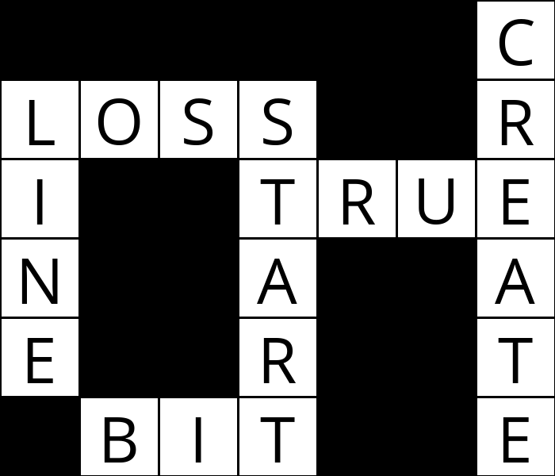

# Optimization - Crossword 
Build a completed crossword puzzle that contains unique words from "wordset" and has the construction of "structure". The crossword is modeled as a Constraint Satisfaction Problem (CSP) with unary and binary constraints, solved with AC-3 algorithm. 

# Structure
data/structure0.txt
data/structure1.txt
data/structure2.txt

# Wordset
data/words0.txt
data/words1.txt
data/words2.txt

# Running
python generate.py [structure] [wordset]

# Demonstration
https://youtu.be/Ru6TNYDn8Xs
